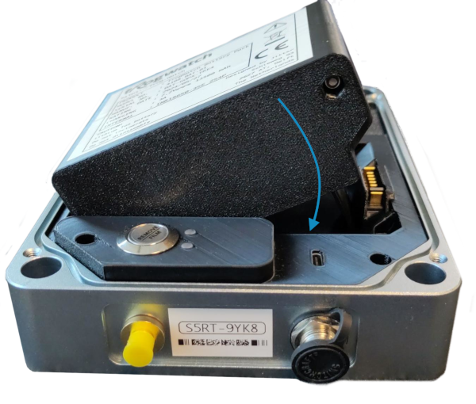

# Battery Pack V2

De battery pack wordt standaard meegeleverd met de Frogwatch meter en is is hier speciaal op ontworpen. Gebruik alleen originele Frogwatch batterypacks. Zo weet je zeker dat ze compatible, veilig en van goede kwaliteit zijn.

## Specificaties

| Algemeen            |        |     |
|---------------------|--------|-----|
| Type                | Li-ion |     |
| Lengte              | 98     | mm  |
| Breedte             | 73     | mm  |
| Hoogte              | 40     | mm  |
| Massa               | 450    | g   |
| Capaciteit          | 13500  | mAh |
| Spanning (nominaal) | 7.2    | V   |
| Oplaadstroom        | 0-3000 | mA  |
| Totale energie      | 97     | Wh  |

| Omgeving           |          |    |
|--------------------|----------|----|
| Beschermingsklasse | IP50     |    |
| Temperatuurbereik  | -10 - 50 | ˚C |

## Aansluiten

*Belangrijk: Lees eerst de [veiligheidsinformatie](../safety-v2/#li-ion-batterij)!*

De accupack past maar op één manier in de Frogwatch. Plaats eerst de linkerkant van de accu. Deze scharniert dan als het goed is bijna vanzelf op zijn plaats. Als er veel kracht nodig lijkt, druk dan niet door! Controleer of er niets tussen zit en plaats de accu opnieuw zoals afgebeeld.
Als de meter al gemonteerd is, let dan extra op dat de accupack niet uit de meter valt tijdens het plaatsen en bevestig het deksel om de accupack goed op zijn plek te houden.

## Opladen

Er zijn twee manieren om de batterij op te laden:

* ### Via de Frogwatch Meter

De makkelijkste manier is om de batterij aan een Frogwatch meter te verbinden. Door de meter met de bijgeleverde 12V voedingsadapter van stroom te voorzien, zal de batterij worden opgeladen.

* ### Via een Frogwatch Li-ion oplader

De [Li-ion oplader](../charger-v2) is een optionele accessoire die apart verkrijg baar is. Vooral handig als je meerdere reserve accupacks hebt die je alvast wilt opladen zodat je deze op de meetlocatie snel kunt verwisselen.

Het 4-polige stekkertje van de lader kun je aan de zijkant van de accupack inklikken. Past het niet? Dan heb je waarschijnlijk de oudere 3-pins [Li-ion oplader V1](../charger-v1). Hiervoor is een verloopkabeltje beschikbaar, neem contact op om deze na te bestellen.

**TODO deze pagina is nog niet af. Contact info@jitter.company voor meer info**

