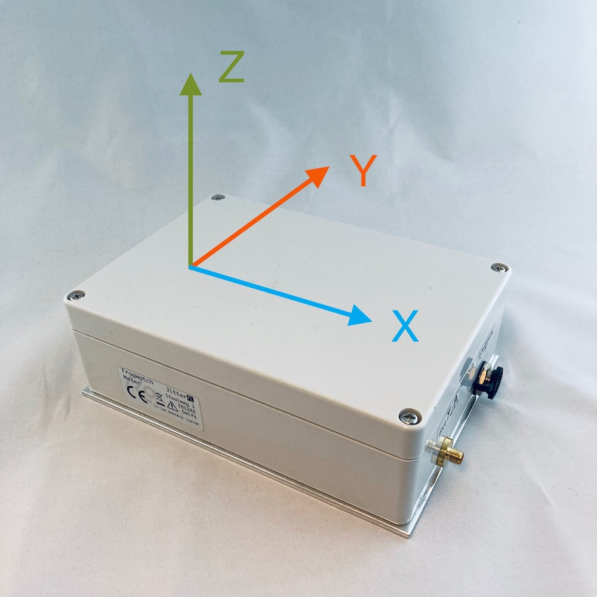
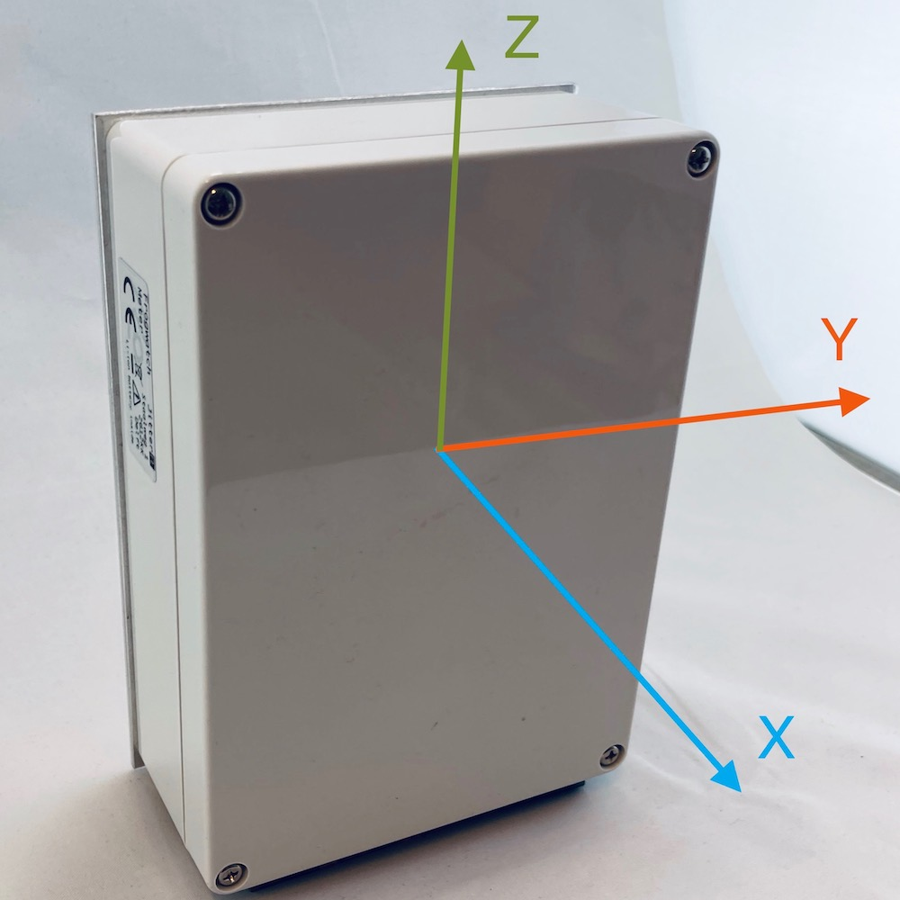
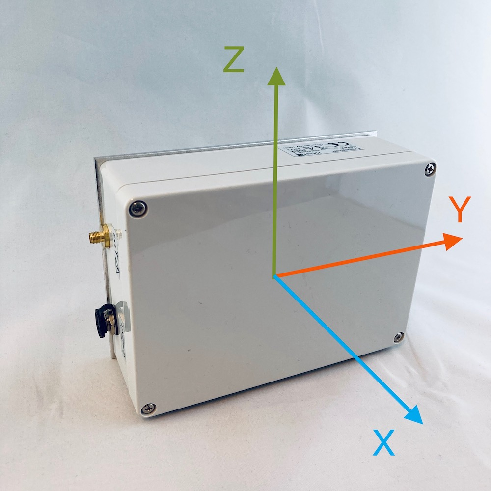

# Veelgestelde vragen

Hier vind je antwoorden op enkele vaker gestelde vragen. Natuurlijk kun je vragen ook altijd [direct aan de makers stellen](https://www.frog.watch/contact/).

# Wat zijn de x,y,z assen in de huidige oriëntatie van de meter?

De meetassen van de Frogwatch draaien zodanig mee dat de `z-as` altijd de as is die het meest richting de zwaartekracht meet. De `x-as` en `y-as` draaien automatisch mee volgens een rechtshandig assenstensel. Hieronder worden de meetassen getoond voor de verschillende orientaties.

## Oriëntatie Plat

In de platte oriëntatie wijst de `z-as` naar boven door de deksel richting de zwaartekracht. De `x-as` wijst naar de lange kant van de meter en de `y-as` naar de zijkant.

## Oriëntatie Rechtop
In de rechtop oriëntatie wijst de `z-as` omhoog richting de zwaartekracht. De `x-as` wijst naar buiten door de deksel en de `y-as` naar de zijkant.

## Oriëntatie Zijwaarts

In een zijwaartse oriëntatie wijst de `x-as` naar voren door de deksel en de `y-as` richting de lange kant van de meter. In de omgekeerde zijwaartse oriëntatie blijven de assen hetzelfde, maar zullen de pijlen de andere kant uit wijzen. Het enige verschil is dat de trillingen in het tijdsdomein keer -1 gaan, maar omdat de meetresultaten absolute waarden gebruiken merk je dat niet.

# Ik heb een meter geplaatst, waarom komt deze niet online in het Dashboard?

Tijdens het opstarten zoekt de meter verbinding met het Frogwatch Dashboard om zijn meetinstellingen op te halen en de tijd te synchroniseren. Normaal gesproken duurt dit niet langer dan 5 minuten. Dit kan in enkele gevallen aanzienlijk langer duren:

## Netwerkbereik

Op sommige meetlocaties kan het zijn dat het netwerkbereik slecht is waardoor het opstarten wat langer duurt. Als het helemaal niet werkt kun je de [antenne via een verlengkabel aansluiten](#sma-connector-externe-antenne).

## Meetdata vorige sessie

Tijdens het opstarten wordt eventuele meetdata van een vorig project opgestuurd naar de server. Pas als dit compleet is worden de nieuwe instellingen toegepast. Op deze manier weten we zeker dat alle meetdata na het opstarten bij de laatste instellingen hoort. Meestal zie je na enkele minuten in het Frogwatch Dashboard dat de meter op `Opstarten` springt, maar in combinatie met slecht netwerkbereik kan dit even duren.

## Antenne

Controleer of de antenne goed vastgeschroefd is. Als de antenne recent via een verlengkabel gebruikt is kan het zijn dat deze niet goed teruggeplaatst is.

## Defect of een ander probleem

Als de meter op meerdere locaties niet online komt, ook na langere tijd, dan is er mogelijk iets mis. [Neem contact op](https://www.frog.watch/contact/) en we gaan het voor je uitzoeken.

# Ik heb een meter op afstand gestart, wanneer begint de meting?

De Frogwatch meters maken af en toe verbinding met het Dashboard om nieuwe instellingen op te halen. Dit gebeurt standaard elke `15 minuten`. Daarnaast komt de meter meteen online als er iets belangrijks gebeurt, bijvoorbeeld bij foutmeldingen, overschrijdingen of als er een meting start/stopt. Het kan dus maximaal 15 minuten duren. Dit is instelbaar onder `Meters`, selecteer een meter, `instellingen`, `synchronisatie interval`. Door niet continue online te komen wordt stroom bespaard om de accuduur te optimaliseren.

# Er is een overschrijding geweest, waarom heb ik geen SMS / email gehad?

Controleer de configuratie of de `Bewaking` goed is ingesteld. Het kan zijn dat de vorige overschrijding korter dan het `Alarminterval` geleden is, of dat de `Alarmeringsgevoeligheid` te hoog staat. Voor meer informatie, zie de [documentatie over bewaking](dashboard/#bewaking).

Daarnaast kan het zijn dat de contactpersoon ingesteld is voor een hoger percentage of dat deze contactpersoon geen e-mail of SMS wil ontvangen op deze dag. Dit kun je instellen in het menu `Toegang`, `Contacten`.

# Komen er updates beschikbaar voor de Frogwatch Meter?

Er zullen af en toe firmware updates beschikbaar komen in het Frogwatch Dashboard.
Deze updates bevatten verbeteringen of nieuwe functionaliteit voor de Frogwatch Meter.
Ga naar `Meters`, `Firmware`. Hier zie je een lijst met de meters en welke firmware versie deze gebruiken. Je kunt zelf kiezen welke meters je wanneer wilt updaten en naar welke versie.

# Wordt de meetdata veilig bewaard? Wie kan mijn data inzien?

Alle Frogwatch meetdata wordt veilig op een Nederlandse server opgeslagen en automatisch gebackupt. Zo zorgen we dat meetgegevens nooit verloren gaan.

Frogwatch is een product van Jitter. De systeembeheerders van Jitter kunnen uw data inzien als dit nodig is. Zij zullen deze gegevens niet delen met derden. Daarnaast kunt u zelf beheren welke personen toegang hebben tot het Frogwatch Dashboard. Ga hiervoor in het hoofdmenu naar `Organisatie`, `Gebruikers`.

# Ik heb een andere vraag.

Voor aanschaf, informatie en service staat het team voor je klaar dat Frogwatch ontwikkelde. Wij zullen ons best doen om vragen zo goed mogelijk te beantwoorden en eventuele problemen op te lossen. [Neem contact op](https://www.frog.watch/contact/).