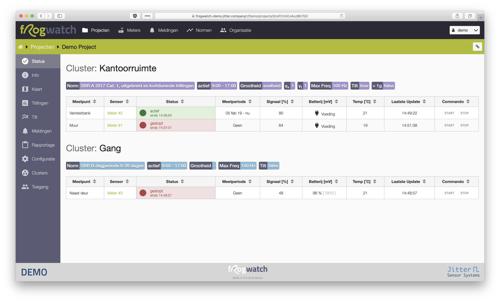
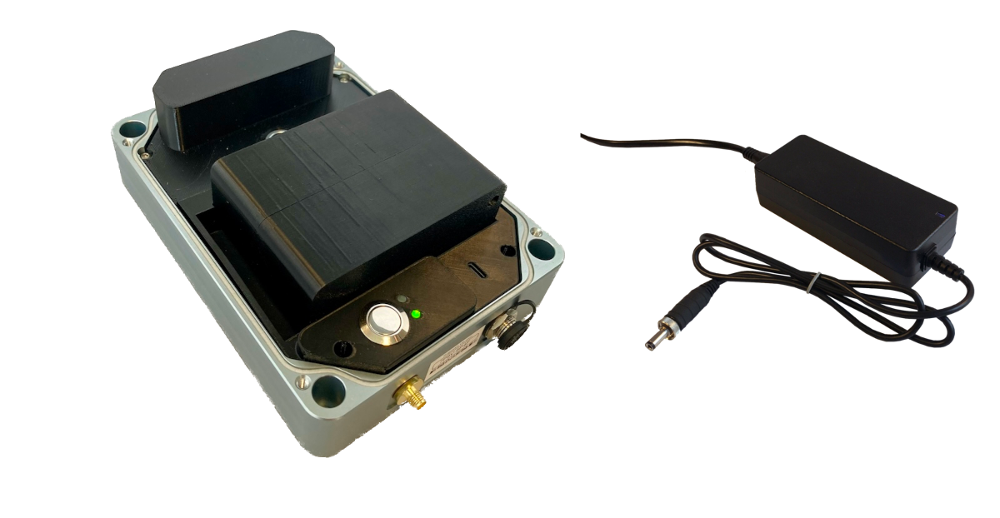
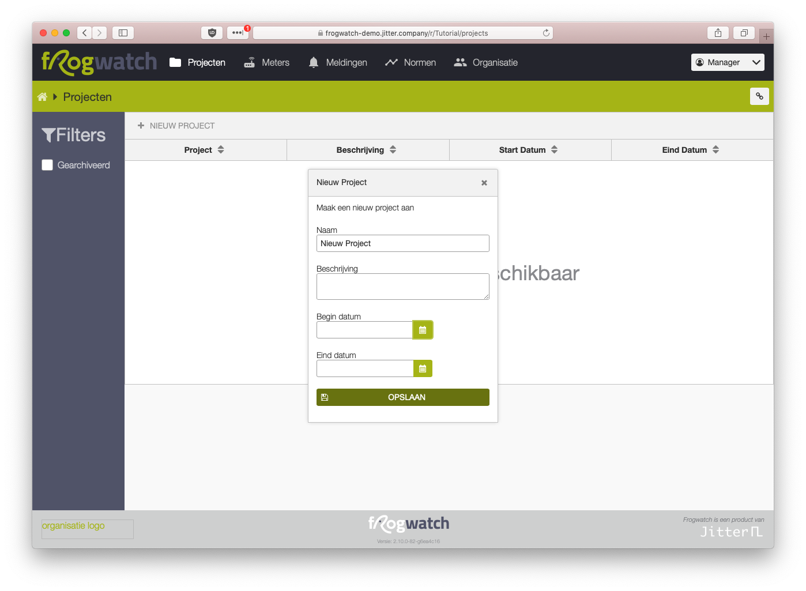
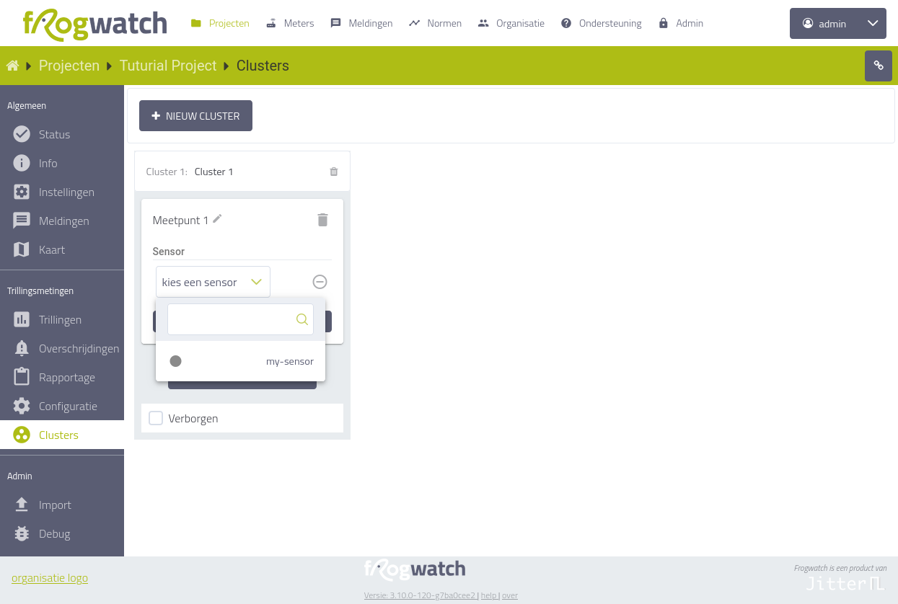
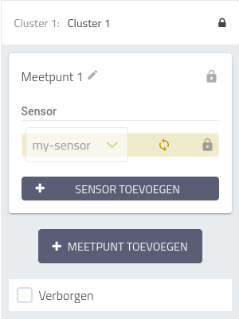
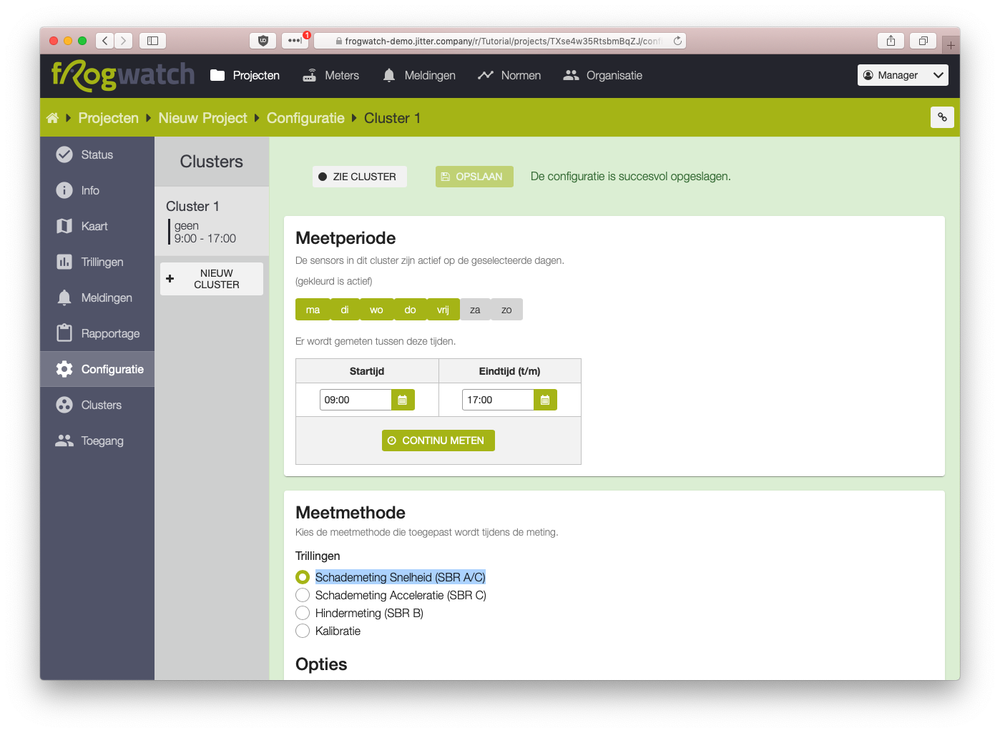
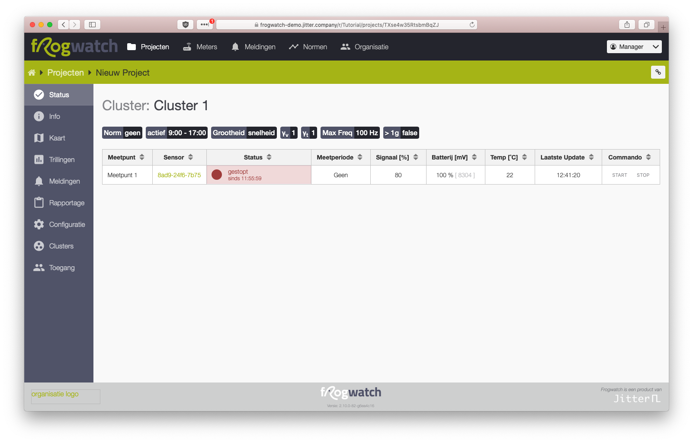
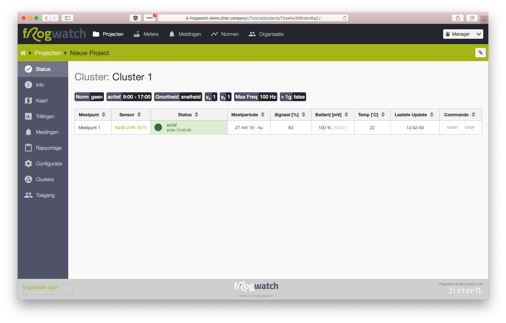

# Werken met de Frogwatch Meter

Op deze pagina helpen we je op weg om snel aan de slag te kunnen met Frogwatch. We laten stap voor stap zien hoe je de meter opstart en instelt om te meten.

Zoek je wat uitgebreidere informatie? In het menu [Hardware](../hardware-v2/) vind je meer informatie over de apparatuur. Bij [Dashboard](../dashboard/) gaan we dieper in op de opties die het Frogwatch Dashboard biedt.

 Gaat er iets mis of loop je vast tijdens een van de stappen? Je kunt natuurlijk altijd [contact met ons opnemen](https://www.frog.watch/contact/).

## Inloggen op het Frogwatch Dashboards

Wanneer je voor de eerste keer een Frogwatch Meter aanschaft wordt er een account voor je aangemaakt op het [Frogwatch Dashboard](https://dashboard.frog.watch). Je ontvangt een email met een link om je wachtwoord in te stellen.

In het menu `Organisatie` kun je zelf extra gebruikersaccounts toevoegen en zaken zoals contactgegevens en een bedrijfslogo toevoegen.

Nog geen Frogwatch aangeschaft, maar wel benieuwd hoe dit eruit ziet? Neem een kijkje op het [Gratis demo dashboard](https://demo.frog.watch/). Login met *demo@jitter.company*, wachtwoord *demo*.

## De Frogwatch apparatuur

De Frogwatch meter wordt standaard geleverd inclusief de verwisselbare battery pack. Deze is normaal gesproken voldoende opgeladen om meteen aan de slag te kunnen. Daarnaast kan de meter van stroom worden voorzien via de 12V voedingsadapter.

Heb je de bovenstaande Frogwatch apparatuur ontvangen? Dan is het tijd om aan de slag te gaan!

## Frogwatch Meter aanzetten

1. Log in op Frogwatch Dashboard en klik in het hoofdmenu op Meters voor een overzicht van alle meters binnen uw organisatie.
2. Open de deksel van de meter en sluit de batterij aan.
3. De groene LED knippert kort waarna beide LEDs tegelijk oplichten. Binnen enkele seconden dooft een van de LEDs en is het systeem opgestart.
4. Een van de LEDs blijft gedurence ca 10 seconden aan om de status van de meting aan te geven. Ondertussen zoekt de sensor verbinding met het internet.
5. Op het Dashboard zie je na een tijdje de status bijwerken. Bij `Laatste Update` kun je zien wanneer de sensor voor het laatst online is gekomen.
6. De status van het systeem staat nu waarschijnlijk op `geen config`. Dit betekent dat de meter nog niet is geconfigureerd met meetinstellingen.

Het kan even duren voor de meter online komt. Lukt het niet? Kijk dan even bij de [veelgestelde vragen](faq/#ik-heb-een-meter-geplaatst-waarom-komt-deze-niet-online-in-het-dashboard) of neem contact met ons op.

## Frogwatch configureren
Nu de meter opgestart is kunnen we deze gaan instellen om een meting te starten:

1. Maak een nieuw project aan
    

2. Voeg binnen het project een nieuw cluster toe, met een nieuw meetpunt en kies de Meter voor Meetpunt 1. Kies eventueel een naam voor het meetpunt dat de meetlocatie goed beschrijft.
    

3. Bevestig de keuze door op het link symbool te klikken. De meter is nu aan het meetpunt gekoppeld.
    

4. Vervolgens stellen we de meetconfiguratie in onder het `Configuratie` menu.
5. Klik op Cluster 1.
6. Klik op `CONTINU METEN` en kies onder Meetmethode voor `Schademeting Snelheid (SBR A/C)` en klik op `OPSLAAN`.
    

7. Zodra de meter de nieuwe configuratie ontvangen heeft wordt de status `gestopt`. In het project `Status` menu kun je de meting nu starten door op `START` te klikken.
    

8. Zodra de meter opnieuw online komt (hoe vaak dit gebeurt is instelbaar) start de sensor met meten en springt de status op `actief`. *Tip: druk even op de knop op de meter, deze zoekt dan onmiddelijk verbinding met het dashboard. Je hoeft dan minder lang te wachten*.
    

Als alles is goed gegaan heb je zojuist de eerste meting gestart!

Nu de meter actief is worden de trillingen gemeten en periodiek opgestuurd naar het Frogwatch Dashboard. In de [documentatie over het Dashboard](../dashboard) kun je meer info vinden over alle mogelijkheden zoals [Trillingsnormen](../dashboard/#trillingsnormen), [Automatische rapportages](../dashboard/#rapportage) en nog veel meer.
