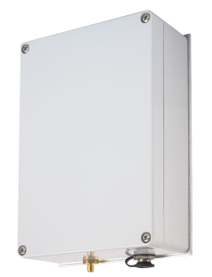
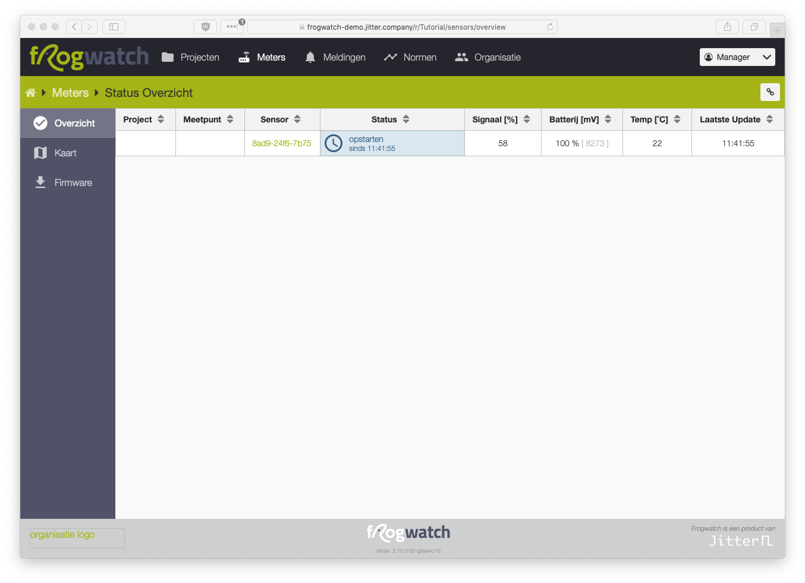

# Werken met de Frogwatch Meter

Op deze pagina helpen we je op weg om snel aan de slag te kunnen met Frogwatch. We laten stap voor stap zien hoe je de meter opstart en instelt om te meten.

Zoek je wat uitgebreidere informatie? In het menu [Hardware](../hardware/) vind je meer informatie over de apparatuur. Bij [Dashboard](../dashboard/) gaan we dieper in op de opties die het Frogwatch Dashboard biedt.

 Gaat er iets mis of loop je vast tijdens een van de stappen? Je kunt natuurlijk altijd [contact met ons opnemen](https://www.frog.watch/contact/).

## Inloggen op het Frogwatch Dashboards

Wanneer je voor de eerste keer een Frogwatch Meter aanschaft wordt er een account voor je aangemaakt op het [Frogwatch Dashboard](#todo). Je ontvangt een email met een link om je wachtwoord in te stellen.

In het menu `Organisatie` kun je zelf extra gebruikersaccounts toevoegen en zaken zoals contactgegevens en een bedrijfslogo toevoegen.

Nog geen Frogwatch aangeschaft, maar wel benieuwd hoe dit eruit ziet? [Probeer de gratis demo](https://www.frog.watch/demo/).

## De Frogwatch apparatuur

Dit is de Frogwatch meter. Binnen in de meter bevind zich de verwisselbare battery pack zoals hieronder afgebeeld. Daarnaast leveren we standaard een 12V voedingsadapter mee. De meegeleverde batterij is in de meeste gevallen voldoende opgeladen om meteen aan de slag te kunnen.

Frogwatch Battery Pack: oplaadbare li-ion batterij

Frogwatch 12V voedingsadapter

 

Heb je de bovenstaande frogwatch apparatuur ontvangen? Dan is het tijd om aan de slag te gaan!

## Frogwatch Meter aanzetten

1. Log in op Frogwatch Dashboard en klik in het hoofdmenu op Meters voor een overzicht van alle meters binnen uw organisatie.
2. Open de deksel van de meter en sluit de batterij aan.
3. De rode LED gaat aan en de groene LED knippert een aantal keer tijdens het opstarten.
4. Vervolgens na ongeveer 15 seconde gaan de LEDs om en om knipperen. Dit betekent dat de meter verbinding zoekt met de server en eventuele data uitwisselt.
5. Op het Dashboard springt de status van de Meter na een tijdje op `opstarten`.
    
6. Zodra de lampjes uitgaan is de sensor opgestart, gesynchroniseerd en klaar voor gebruik. Dit duurt circa 0.5 - 3 minuten, afhankelijk van hoeveel data er uit te wisselen is met de server.
7. De status van het systeem staat nu op `geen config`. Dit betekent dat de meter nog niet is geconfigureerd met meetinstellingen.
    

Het kan even duren voor de meter online komt. Lukt het niet? Kijk dan even bij de [veelgestelde vragen](faq/#ik-heb-een-meter-geplaatst-waarom-komt-deze-niet-online-in-het-dashboard) of neem contact met ons op.

## Frogwatch configureren
Nu de meter opgestart is kunnen we deze gaan instellen om een meting te starten:

  
8. Maak een nieuw project aan
    
9. Voeg binnen het project een nieuw cluster toe, met een nieuw meetpunt en kies de Meter voor Meetpunt 1.
    
10. Klik op het link symbool om de sensor ook daadwerkelijk te koppelen aan dit cluster/meetpunt.
    
11. Vervolgens stellen we de meetconfiguratie in onder het `Configuratie` menu.
12. Klik op Cluster 1.
13. Klik op `CONTINU METEN` en kies onder Meetmethode voor `Schademeting Snelheid (SBR A/C)` en klik op `OPSLAAN`.
    
14. Klik 2 keer op de knop op de Meter zodat de meter meteen contact zoekt met de server. Zodra deze de nieuwe configuratie ontvangen heeft wordt de status `gestopt`.
    
15. Start de meting door 2 keer op de knop te klikken. De eerste klik activeert het menu en laat de huidige status zien (rood = gestopt). De tweede keer drukken start de meting (groen knipperend). Je kunt de meter ook starten via de start knop in het status overzicht op Frogwatch Dashboard. Hierna zal de status groen `actief` aangeven.
    

Als alles is goed gegaan heb je zojuist de eerste meting gestart!

Nu de meter actief is worden de trillingen gemeten en periodiek opgestuurd naar het Frogwatch Dashboard. In de [documentatie over het Dashboard](../dashboard) kun je meer info vinden over alle mogelijkheden zoals [Trillingsnormen](../dashboard/#trillingsnormen), [Automatische rapportages](../dashboard/#rapportage) en nog veel meer.
