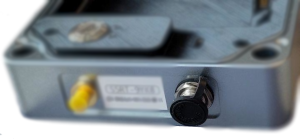
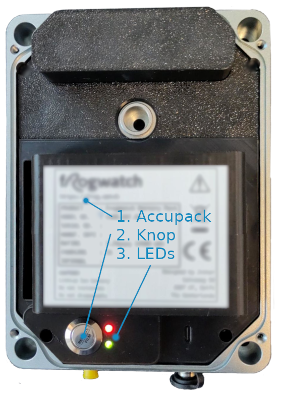
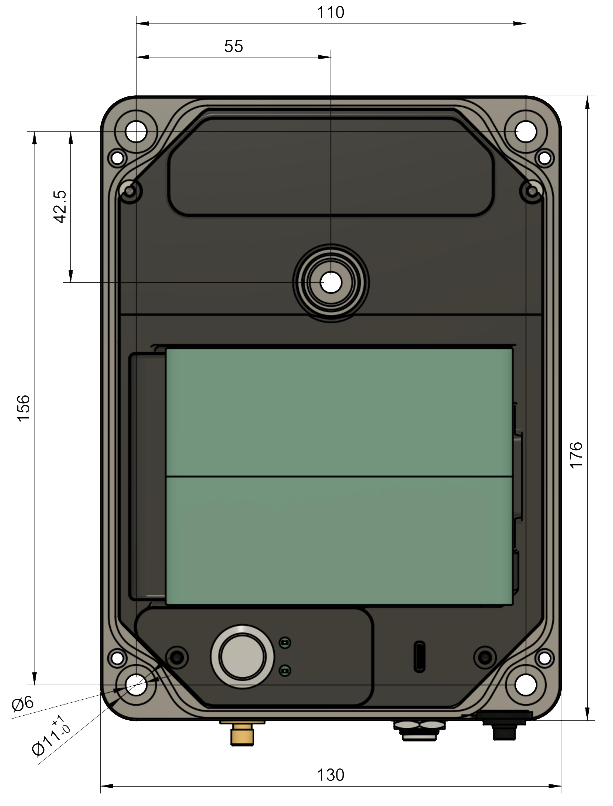
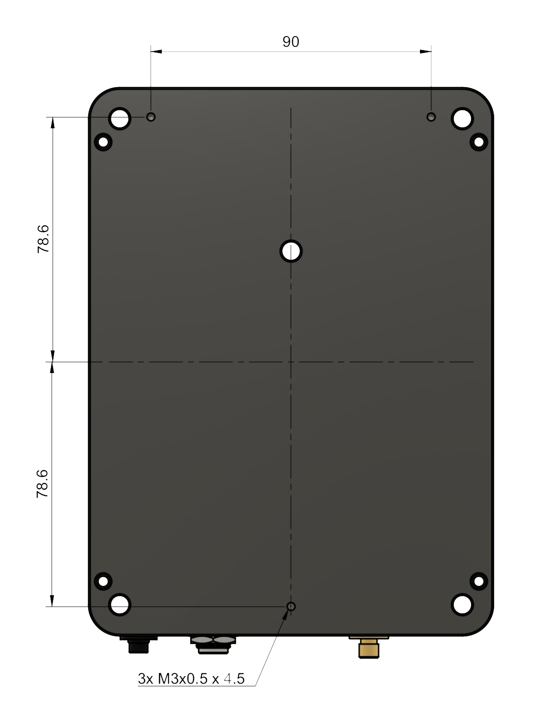

# Frogwatch Meter V2

 

## Specificaties

In onderstaande tabellen vind je een overzicht van de belangrijkste specificaties van het systeem.
Hiermee kun je snel beoordelen of de Frogwatch V2 geschikt is voor jouw toepassing.

| 
Algemeen
 | 
 |    |
|----------------------|--------|----|
| Lengte               | 175    | mm |
| Breedte              | 130    | mm |
| Hoogte               | 60     | mm |
| Massa                | 900    | g  |
| Voedingsspanning     | 6 - 24 | V  |
| Voedingsstroom (max) | 3000   | mA |

| 
Omgeving
 | 
 |    |
|--------------------|----------|----|
| Beschermingsklasse | IP65     |    |
| Temperatuurbereik  | -10 - 50 | ˚C |

| 
Trillingsmetingen
 | 
|                  |
|------------------------------|------------|------------------|
| Frequentiebereik (SBR A)     | 1 - 100    | Hz               |
| Frequentiebereik (SBR B)     | 1 - 80     | Hz               |
| Meetbereik snelheid @ 1Hz    | 0.1 - 1560 | mm / s           |
| Meetbereik snelheid @ 100 Hz | 0.1 - 15.6 | mm / s           |
| RMS ruis snelheid            | 0.016      | mm / s           |
| Meetbereik acceleratie       | 9810       | mm/s2 |
| RMS ruis acceleratie         | 1.5        | mm/s2 |

**Let op:** lees eerst de [Veiligheidsinformatie](../safety-v2) voordat je met Frogwatch apparatuur aan de slag gaat!

Snel aan de slag? Zie [Werken met de Frogwatch Meter](..//gettingstarted/).

## Externe aansluitingen

Het concept van de Frogwatch meter is dat je alles kunt instellen en bedienen via het online dashboard. Aan de buitenkant zitten geen display, knoppen of LEDs die eventuele aandacht kunnen trekken van vandalen of nieuwsgierige passanten. Er zijn slechts twee (optionele) aansluitingen aan de onderkant. Er zijn wel meer opties toegankelijk als je het [deksel opent](#binnen-het-deksel).

### DC jack: 12V voeding

Hier kan een [12V voedingsadapter](../adapter-12v) worden aangesloten. Als de meting langer duurt dan de batterijduur, dan is het handig om de 12V voeding aan te sluiten. Je kunt dan ongelimiteerd meten zonder batterijen te hoeven wisselen. Het wel is aan te raden om altijd een [battery pack](../battery-v2) aan te sluiten. Hierdoor blijft de meting doorgaan mocht de stroom uitvallen of iemand per ongeluk de stekker eruit trekken. Je kunt via het [Frogwatch Dashboard](../dashboard) zien of de adapter is aangesloten en hoe vol de batterij is.

Zorg ervoor dat het rubberen dopje (zoals afgebeeld) dichtgedrukt is als deze connector niet gebruikt wordt. Dit is nodig voor behoud van de IP-65 eigenschappen (voorkomen dat stof en/of water in de behuizing komt).

### SMA connector: externe antenne

Het kan voorkomen dat er geen of onvoldoende netwerkbereik is op een meetlocatie. Bijvoorbeeld bij ondergrondse metingen of in afgeschermde ruimtes. In deze situaties kan een een externe LTE antenne worden aangesloten.
Hiervoor is een geschikte LTE antenne + kabel nodig. Deze accesoires zijn op aanvraag los verkrijgbaar.

#### Aansluiten

*Belangrijk: Lees eerst de [veiligheidsinformatie](../safety-v2/#sma-connector-externe-antenne)!*

1. Haal het gele dopje van de SMA connector
2. Verbind de externe antenne door de conector aan te draaien.
3. Als de antenne juist aangesloten is schakelt de Frogwatch automatisch over.
4. Experimenteer eventueel met een geschikte antenne locatie en zet de antenne en kabels degelijk vast.

#### Loskoppelen
1. Scrhoef de antennekabel los. De frogwatch zal automatisch terug schakelen naar de ingebouwde antenne.
2. Plaats het beschermingsdopje weer op de connector.

## Binnen het deksel
Het deksel dient om de meter te beschermen en houdt de accupack op zijn plaats. De IP-65 beschermingsklasse geldt alleen met het deksel gesloten. Het deksel is te openen door de vier inbus boutjes los te draaien. De boutjes blijven aan het deksel vastzitten zodat je ze niet kwijt raakt.

*Let op: de binnenste (met torx schroefjes bevestigde) onderdelen zijn niet bedoeld om te openen. Als deze toch geopend wordt, kan ivm de gevoelige elektronica een servicebeurt en/of kalibratie nodig zijn.*

Zoals op de afbeelding aangegeven vind je binnen in de Frogwatch de volgende onderdelen:

1. De verwisselbare [accupack](../battery-v2)
2. De status/start/stop knop
3. De status LEDs

### Aansluiten accupack

De accupack past maar op één manier in de Frogwatch. Plaats eerst de linkerkant van de accu. Deze scharniert dan als het goed is bijna vanzelf op zijn plaats. Als er veel kracht nodig lijkt, druk dan niet door! Controleer of er niets tussen zit en plaats de accu opnieuw zoals afgebeeld.
Als de meter al gemonteerd is, let dan extra op dat de accupack niet uit de meter valt tijdens het plaatsen en bevestig het deksel om de accupack goed op zijn plek te houden.

#### Standby

Zolang de batterij aangesloten is, zal de Frogwatch periodiek verbinding maken met het online dashboard, ook als er geen meting actief is. Dit maakt het mogelijk om metingen op afstand te starten. In deze standby stand gaat de batterij veel langer mee dan tijdens het meten, maar als je de meter volledig uit wilt zetten kun je de batterij loshalen.

### Status LEDs

De twee status LEDs zijn bedoeld om tijdens het plaatsen of een snelle inspectie te zien wat de meter aan het doen is. Uitgebreidere informatie is beschikbaar op het [Statusoverzicht op het Frogwatch Dashboard](../dashboard/#statusoverzicht-meters).

#### Opstarten

Zodra de Frogwatch van stroom word voorzien beginnen de LEDs te knipperen. Dit duurt normaal gesproken slechts enkele seconden:

| LED                                 | Betekenis                 | Hoe lang duurt het |
|-------------------------------------|---------------------------|--------------------|
| groene LED knippert aan/uit         | voorbereiden op opstarten | < 1 seconde        |
| beide LEDs staan aan                | bezig met opstarten       | < 4 seconden       |
| groene LED knippert zeer snel (8Hz) | firmware update           | < 2 minuten        |
| rode LED knippert steeds 2x kort    | firmware update mislukt   | < 15 minuten       |

Normaal gesproken zie je alleen de eerste twee patroontjes en is het systeem binnen 5 seconden opgestart.
Als je via het Dashboard een firmware update hebt klaargezet zal de meter deze downloaden en daarna tijdens het opnieuw opstarten toepassen. Dit kan enkele minuten duren.

Als bij het opstartend beide LEDs tegelijk aan blijven en niet meer uit gaan of de rode LED blijft minutenlang snel knipperen dan is er iets mis met de firmware. Neem in dat geval contact op voor een reparatie.

#### Status

Na het opstarten laat de meter gedurende ca 10 seconden de status zien. Daarna gaan de LEDs uit om stroom te besparen. Druk eventueel op de [Status / Start / Stop knop](#status-start-stop-knop) om de LEDs opnieuw op te lichten.

| LED                 | Betekenis                                    |
|---------------------|----------------------------------------------|
| groene LED aan      | Meting standby (zie dashboard voor planning) |
| groene LED knippert | Meting actief                                |
| rode LED aan        | Meting gestopt                               |
| rode LED knippert   | Geen meetconfiguratie of foutmelding         |
| om-en-om knipperend | Opstarten, zelftest of firmware update       |

Als de meter standby is betekent dit dat de meting automatisch actief zal worden volgens de planning die in het Frogwatch Dashboard is ingesteld. Als de rode LED knippert is de meter waarschijnlijk nog niet ingesteld via het Frogwatch Dashboard. In het dashboard vind je uitgebreidere status informatie.

### Status / Start / Stop knop

De knop op de meter heeft de volgende functies:

#### Status
Als de LEDs uit staan, zorgt de eerste druk op de knop dat de LEDs aan gaan en de status laten zien zoals hierboven beschreven. Ook zorgt dit ervoor dat de meter onmiddelijk verbinding zoekt met het dashboard zodat daar zo snel mogelijk de uitgebreidere status informatie en de laatste meetdata beschikbaar komen.

#### Start/Stop

Als je de knop nogmaals indrukt (terwijl de status LEDs nog zichtbaar zijn), wisselt de meter tussen actief en gestopt. Aan de status LEDs zie je of de meter inderdaad gestart of gestopt is.

#### Reset

[//]: # "This is actually a hardware feature, button is linked to BQ25672"
Als de knop gedurence ca 15 seconden ingedrukt gehouden wordt, start de sensor zichzelf opnieuw op. Dit is te herkennen aan de [status LEDs](#status-leds).

Door de knop tijdens het (her-)starten ingedruikt te houden, worden bovendien de instellingen gewist en zal de meter niet de vorige meting hervatten.
De [status LEDs](#status-leds) tonen dat er geen instellingen zijn. Ondertussen haalt de sensor zoals gebruikelijk nieuwe instellingen op, waarna het systeem weer klaar voor gebruik is.
Dit kan gebruikt worden om een meting onmiddelijk te stoppen of eventuele problemen op te lossen.

## Montage

De Frogwatch kan op verschillende manieren bevestigd worden. Net als de [Frogwatch V1](../hardware-v1) zijn er vier bevestigingsgaten in de hoeken. Deze vallen onder het deksel waardoor de bevestigingsschroeven van buitenaf niet in het zicht vallen. Onderstaande tekening geeft een overzicht van de afmetingen. Let op dat de afmetingen afwijken van de [Frogwatch V1](../hardware-v1).

 *Afmetingen en bevestigingsopties - bovenaanzicht*

### Snelle montage met 1 schroef

Nieuw sinds V2 is het vijfde bevestigingsgat net boven het midden van de meter. Dit maakt het mogelijk om het systeem snel te plaatsen met maar 1 schroef. Hiervoor hoeft het deksel bovendien niet geopend te worden.
De locatie van dit bevestigingsgat is zo gekozen dat deze vlakbij het zwaartepunt en de interne sensor elementen zit.

We raden aan om te zorgen dat de meter op tenminste drie punten contact maakt met het te meten object. Aan de achterkant van de frogwatch zijn drie kleine bevestigingsgaten waar eventueel een kort boutje ingedraaid kan worden zodat deze drie punten bij het vastschroeven van de schroef tegen de muur worden gedrukt.

 *Afmetingen en bevestigingsopties - onderaanzicht*

Controleer altijd dat de meter stabiel hangt en stijf contact maakt met het te meten object. Vooral als met 1 schroef bevestigd word op bijvoorbeeld op een bolling of uitstekend deel van de muur kan het contact tussen sensor en muur onvoldoende zijn. Dit kan de frequentierespons beinvloeden of de sensor kan zelfs gaan draaien.

## Meter aanzetten

Zodra de Frogwatch meter van stroom is voorzien (via de [accupack](#aansluiten-accupack) of [voeding](#dc-jack-12v-voeding)) start deze meteen op. Als er nog een meting ingesteld was dan word deze binnen ca 15 seconden hervat. Ondertussen maakt het systeem verbinding met het online dashboard om de laatste instellingen op te halen en data op te sturen.

## Verbinding met het Dashboard

De sensor maakt regelmatig verbinding met het Frogwatch Dashboard. Dit gaat automatisch door zolang de meter van stroom voorzien is. Het interval waarop verbinding gemaakt word is online in te stellen. Met een langer interval gaat de batterij aanzienlijk langer mee, maar dit heeft wel als nadeel dat je langer moet wachten totdat de sensor reageert als je de instellingen of start/stop op afstand wijzigt.

Daarnaast komt de sensor onmiddelijk online in een van de volgende situaties:
- Iedere druk op [de knop](#status--start--stop-knop)
- Een overschrijding (als deze een een alarmering veroorzaakt)
- Als zich een fout voordoet tijdens het meten
- Als de meting start of stopt

Om een meting te starten moet deze eerst worden ingesteld. Onder andere het type meting, op welke dagen er moet worden gemeten en de alarmeringen kun je instellen via het [Frogwatch Dashboard](../dashboard).