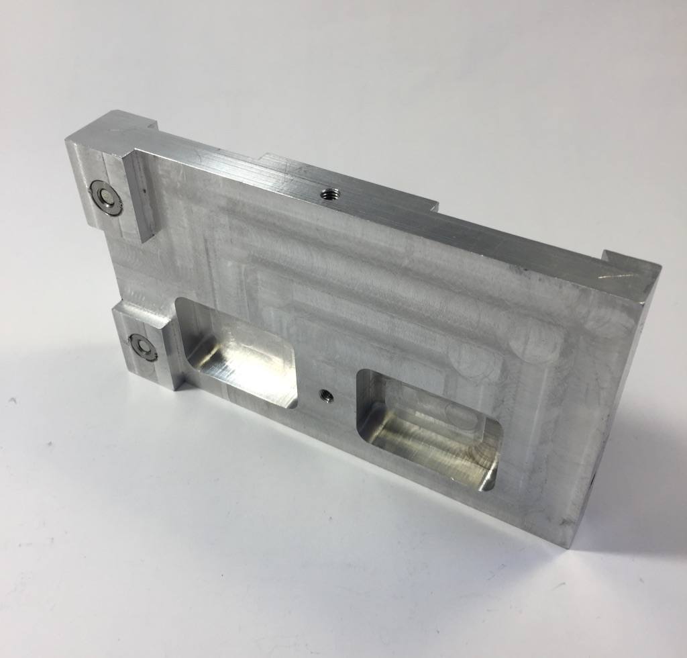
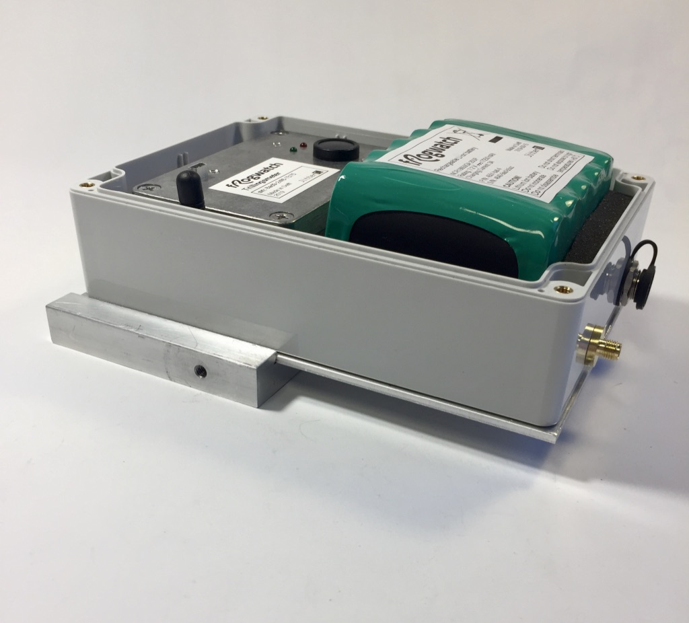

# Kalibratie

Systemen worden voor oplevering gekalibreerd door merkonafhankelijk geaccrediteerd IEC/ISO 17025 laboratorium SONOR Kalibratie. De kalibratie wordt uitgevoerd volgens een procedure gerelateerd aan [ISO 16063-21](https://www.iso.org/standard/27053.html). Tijdens een kalibratie wordt de Frogwatch trillingsmeter vergeleken met een geijkte referentieopnemer. De kalibratie dient tevens als een extra testmoment om te kijken of alles goed werkt buiten het laboratorium.

Alle systemen worden voor alle 3 de assen, de `X`, `Y` en `Z` richting gekalibreerd op twee verschillende frequenties: `15.916 Hz` en `79.433 Hz`.

Tijdens de kalibratie wordt de gehele meetketen gecheckt. Dus niet alleen de opnemer/sensor, maar het gehele geintegreerde systeem: sensor + elektronica en elektronische en digitale filters als mede de uitlees- en verwerkingsoftware.

## Kalibratie-adapter

Voor kalibratie van Frogwatch systemen is een speciale adapter vereist om het systeem te bevestigen op de kalibratie-opstelling.

Via deze adapter kan het systeem in alle 3 de richtingen gekalibreerd worden. De adapter is zo ontworpen dat de bevestiging zo dicht mogelijk bij het zwaartepunt van het geheel ligt.

Het is aan te raden om de kalibratie met externe voeding én zonder batterij uit te voeren om de belasting op de kalibratie-apparatuur te minimaliseren.