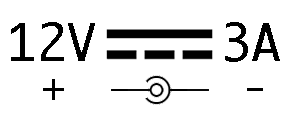

# Veiligheidsinformatie

## Lees dit eerst

Deze pagina bevat belangrijke informatie over veilig gebruik van de Frogwatch Meter. **Het is belangrijk dat je deze handleiding leest voordat je met de Frogwatch meter aan de slag gaat**.

## Omgevingscondities

* Beschermingsklasse: IP65 (12VDC dopje gesloten)
* Temperatuur: -10 tot 50 ℃.
* Luchtvochtigheid: 0-90%

**Let op**: de meegeleverde voedingsadapter is niet bedoeld voor buitengebruik. Hoewel de connector zelf IP-65 haalt, dient de voedingsadapter zelf goed beschermd te worden tegen weersinvloeden.

Uitgebreide specificaties over de meter zelf vind je bij het hoofdstuk [Hardware - Frogwatch V2](../hardware-v2).

## Betekenis symbolen

Op de frogwatch is een aantal symbolen aangebracht, deze worden hieronder toegelicht:

 *Specificatie voedingsadapter*

Bovenstaand symbool verwijst naar de [12V aansluiting](#dc-jack-12v-voeding) en toont daarbij de specificaties: 12V, 3A gelijkstroom. Lees eerst deze handleiding voordat je de voeding aansluit.

 *Aansluiting externe antenne*

Bovenstaand symbool verwijst naar de [aansluiting voor de (optionele) externe antenne](#sma-connector-externe-antenne). Onjuist gebruik kan gevaren opleveren, lees eerst deze handleiding voordat je de externe antenne optie gebruikt.

 *Recycling instructie: niet bij het restafval!*

Bovenstaand symbool betekent dat dit product niet zomaar bij het restafval mag worden weggegooid. De Frogwatch bevat elektronica die apart moet worden ingezameld. Ook voor de Battery packs en de meeste andere accessoires geld dat deze apart moet worden gerecycled. Neem [contact](../about/) op voor recycling of vragen hierover.

## Benodigde accessoires
Om de Frogwatch meter veilig en juist te gebruiken zijn de volgende accesiores benodigd:

* De [Frogwatch accupack](../battery-v1)
* De [12V voedingsadapter](../adapter-12v)

Deze accesoires worden standaard meegeleverd met de Frogwatch meter en zijn ook los verkrijgbaar. Gebruik alleen de officiële accesoires.

## Li-ion batterij

De Frogwatch meter maakt gebruik van een Li-ion accupack. Accupacks kunnen een brandrisico vormen als deze beschadigd raken door bijvoorbeeld een impact of externe hittebron. Omdat de accupack zeer veel energie bevat is het belangrijk hier zorgvuldig mee om te gaan:

* **Sluit het deksel altijd af waar mogelijk** 
    Tenzij dit niet mogelijk is doordat het systeem bemand gebruikt wordt is het aan te raden het deksel goed dicht te schroeven. Hiermee is de accupack maximaal beschermd.
* **Wees extra voorzichtig zolang het deksel geopend is** 
    Bij een bemande meting is de deksel geopend. In deze situatie dient er altijd iemand aanwezig te zijn. Daarnaast moet er extra opgelet worden om beschadiging en/of verhitting van de accupack te voorkomen. Op momenten dat het deksel niet geopend hoeft te zijn, kan deze het beste meteen weer gesloten worden.
* **Voorkom (brand-)gevaarlijke situaties** 
    Zorg dat de Frogwatch niet direct in de buurt van brandgevaarlijke stoffen, open vuur, hittebronnen of vergelijkbare situaties geplaatst wordt. Zeker met het deksel open moet hier extra op worden gelet: zorg dat er bijvoorbeeld geen scherpe voorwerpen of sigaretten in de buurt van de batterijen kunnen komen. Maak bij twijfel over de risico's van een locatie een risico analyse.
* **Gebruik alleen officiële accupacks** 
    De Frogwatch accupacks zijn speciaal ontworpen voor de Frogwatch meter. Gebruik van eventuele andere accupacks kan ernstig gevaar opleveren en is voor eigen risico.
* **Probeer de accupack nooit op te laden met een ongeschikte oplader** 
    De accupacks dienen ofwel via de Frogwatch zelf, ofwel via de [los verkrijgbare oplader](../hardware-v2/#li-ion-oplader) opgeladen te worden. Gebruik van andere opladers kan mogelijk gevaar opleveren en is voor eigen risico.

* **Trek nooit aan kabels** 
    Bij gebruik in de frogwatch zelf is sinds V2 geen kabel meer nodig. Als deze toch gebruikt worden (bijvoorbeeld bij het opladen), wees dan voorzichtig met het losklikken.
    Pak altijd de connector zelf vast en trek niet aan de kabel(s)/draden. Er is niet veel kracht nodig om de connector los- en vast te maken: om de batterij los te koppelen druk je op de klikverbinding zodat deze gemakkelijk los komt.

* **Wees extra voorzichtig bij het opladen** 
    Als je accupacks oplaad met de losse li-ion lader is de pack extra kwetsbaar omdat deze niet beschermd word door de Frogwatch behuizing. Zorg voor een veilige plek die geschikt is voor het doel:
    - niet opladen of opslaan in een brandgevaarlijke omgeving
    - niet opladen bij hoge omgevingstemperaturen (+40 ℃)
    - minimaliseer risico op struikelen, contact met dieren, kinderen etc
    - minimaliseer risico op beschadiging van de accupacks of oplader
    - stop onmiddelijk bij (tijfel aan) beschadiging, hitte, vreemde geuren, etc

* **Doe geen gevaarlijke dingen met een accupack:** 
    - Gebruik deze niet waar het niet voor bedoeld is
    - Vermijd situaties met hoge temperaturen (+60 ℃)
    - Vermijd contact met scherpe voorwerpen
    - Probeer deze niet te repareren
    - Haal deze niet uit elkaar
    - Gooi nooit met accupacks
    - Sluit deze niet kort
    - Steek deze nooit in brand

* **Gebruik nooit beschadigde accupacks** 
    - Als een accupack (al dan niet deels) beschadigd of versleten lijkt, of als er een vermoeden van beschadiging is (bijvoorbeeld door het laten vallen), dient de accupack niet meer gebruikt te worden en onmiddelijk te worden veiliggesteld om brandrisico's te minimaliseren.
    - Na een incident kant een batterij in eerste instantie nog ongevaarlijk lijken, maar een tijd later opeens toch een brandgevaar vormen.
    - In het geval dat er een vloeistof of andere substantie in de accupack terecht komt, eruit lekt of zichtbaar is, dient de accupack niet meer gebruikt te worden en onmiddelijk te worden veiliggesteld om brandrisico's te minimaliseren.

## Externe Aansluitingen

### USB aansluiting (binnen deksel)

De USB-C aansluiting wordt op dit moment niet ondersteund. Er komt mogelijk een toekomstige software update waarna deze deze gebruikt kan worden om data uit te wisselen met een computer. Gebruik hiervoor een geschikte USB 2.0 full-speed kabel.

* Isolatie: niet geisoleerd
* USB power: max 500mA (opladen interne batterij)
* Signaal: USB 2.0 full-speed
* Spanning: 5V

### DC jack: 12V voeding

#### Specificaties

De Frogwatch heeft een 12V, 3A rated voedingsadapter nodig. De meegeleverde voedingsadapter is hiervoor geschikt. Het gebruikt van de 12V aansluiting wordt verder uitgelegd op de [Hardware pagina](../hardware-v2/#dc-jack-12v-voeding).

**Veiligheidsfuncties:**

* Beveiligd tegen omgekeerde polariteit
* Beveiligd tegen kortsluiting (zekering 3.5 A)
* Beveiligd tegen te hoge spanning

Ondanks deze veiligheidsfuncties raden we toch sterk aan om om de [Frogwatch 12V adapter](../adapter-12v) te gebruiken. Gebruik van een andere voeding is voor eigen risico.

#### Beschermingsklasse

De DC jack voldoet alleen aan de beschermingsklasse IP-65 in de volgende situaties:

1. De rubberen dop is gesloten
2. Er is een IP65-rated connector aangesloten. Let hierbij op dat hoewel de connector van de Frogwatch voeding hieraan voldoet, de voeding zelf geen IP65 rating heeft en dus voldoende beschermd moet worden tegen eventuele weersinvloeden.

### SMA connector: externe antenne

#### Specificaties

* Impedantie: 50 Ohm
* Alleen voor passieve antennes

Bij gebruik van een (optionele) externe antennekabel kunnen gevaren optreden. Bestudeer deze veiligheidsinstructies aandachtig en gebruik de externe antenne alleen wanneer u er zeker van bent dat dit noodzakelijk is en u deze veilig kunt installeren.

### Veiligheidsinstructies

* **Gebruik de verlengkabel alleen wanneer noodzakelijk** 
    In veruit de meeste gevallen zal het netwerkbereik op de meetlocatie prima zijn en is gebruik van de verlengkabel niet nodig.
* **Plaats de antenne binnen het gebouw waar mogelijk** 
    In de meeste gevallen zal de antenne vanuit bijvoorbeeld een kelder verlengd worden naar een locatie waar wel netwerkbereik is, bijvoorbeeld net buiten de kelder (maar nog binnen hetzelfde gebouw).
* **Gebruik de kortste verlengkabel die voldoende is** 
    Hoe langer de kabel is, des te groter het risico dat deze ongewenste en zelfs gevaarlijke spanningen oppakt van bijvoorbeeld (industriële) apparatuur in de nabijheid.
* **Houd rekening met risico's van onweer en vergelijkbare situaties** 
    Bij inslag op of in de buurt van de kabel kan er een gevaarlijk hoge spanning op de kabel komen te staan. Naast schade aan de apparatuur zelf kan dit gevaar opleveren voor personen die in de buurt van de kabel of (in-)direct daaraan verbonden apparatuur zijn of deze toevallig aanraken.
* **Plaats de antenne niet op onnodig gevaarlijke plekken** 
    Door de antenne op een gevaarlijke plek (zoals bovenop een gebouw) te plaatsen is er een verhoogd risico bij bijvoorbeeld blikseminslag. Schakel bij twijfel een expert in.
* **Plaats de antenne en bekabeling zoveel mogelijk buiten bereik van personen** 
    Door de kabels netjes weg te werken minimaliseer je het risico op struikelen en/of beschadiging van de bekabeling.

Het gebruikt van de externe antenne optie wordt verder uitgelegd op de [Hardware pagina](../hardware-v2/#sma-connector-externe-antenne).

## Plaatsing van de Frogwatch meter

De Frogwatch meter is bedoeld voor gebruik door deskundig personeel. Het meetsysteem dient op professionele wijze aangebracht op een geschikte locatie. Bij het selecteren van een meetlocatie dient rekening gehouden te worden met een aantal veiligheidsfactoren:

* **Plaats de meter niet op locaties met een hoog risico op beschadiging** 
Voertuigen, zware of van grote hoogte vallende objecten kunnen de meter dusdanig beschadigen dat er een brandrisico ontstaat in de accupack. Vermijd dit soort risico's dus waar mogelijk.

* **Vervoer de meter op een degelijke manier** 
Ook tijdens vervoer dient het risico op beschadiging beperkt te blijven. Zorg ervoor dat er geen zware voorwerpen op de meter kunnen vallen en dat de meters niet met grote kracht beklemd kunnen raken.

* **Voorkom harde schokken / grote versnellingen** 
De Frogwatch is een gevoelig meetinstrument. Voorkom harde klappen en langdurige acceleraties buiten het meetbereik. Naast risico op zichtbare schade kunnen harde acceleraties de sensorelementen nadelig beinvloeden. Laat bij twijfel de apparatuur opnieuw kalibreren.

* **Laat de accupack(s) niet vallen** 
Zorg dat je de accupack goed in de Frogwatch meter vastklikt bij het plaatsen. Houd de accupack altijd vast tijdens het verwisselen zodat deze niet op de grond valt.
Mocht er toch een accupack op de grond vallen, houd deze dan apart op een brandveilige plek. Om er zeker van te zijn dat deze later niet alsnog een brandgevaar vormt, kun je deze het beste niet meer gebruiken.

* **Plaats de meter pas nadat deze handleiding is gelezen** 
Het is belangrijk dat alle veiligheidsinformatie gelezen en begrepen is voordat met het systeem gewerkt wordt.

## Contactgegevens

Frogwatch is een onderdeel van Jitter. Voor technische ondersteuning, informatie en service staat het team voor je klaar dat Frogwatch ontwikkelde.

Jitter 
Schieweg 93 
2627 AT Delft 

015 – 455 05 74

[info@jitter.company](mailto:info@jitter.company) 
[www.jitter.company](https://www.jitter.company)
