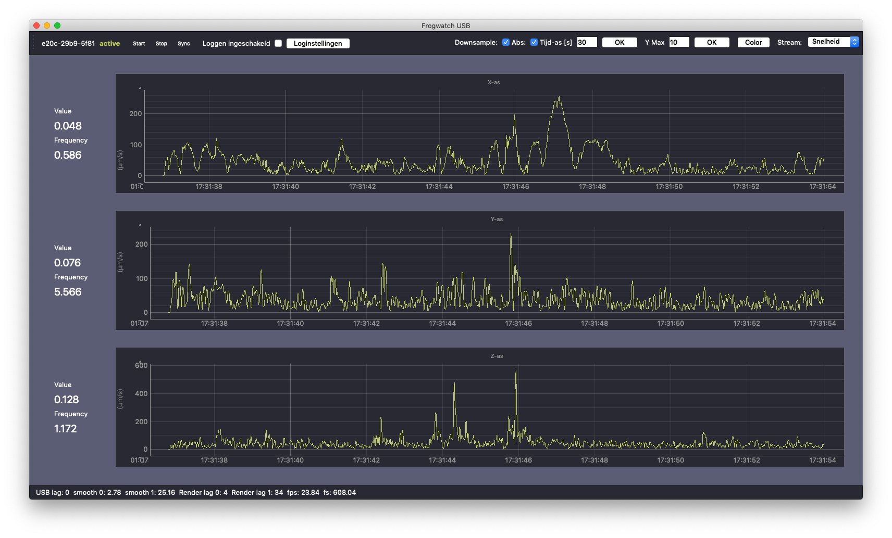
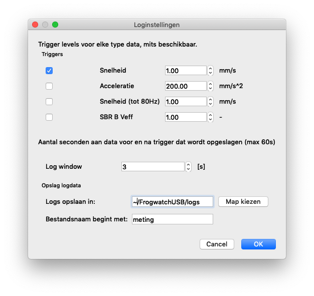

# Realtime inzicht op de meetlocatie

Met de Frogwatch USB software kun je een Frogwatch Meter direct op locatie uitlezen. Naast de berekende SBR waardes heb je hiermee realtime inzicht in het volledige gemeten signaal (de zgn 'waveform'). Hiermee kun je snel vaststellen welke trillingen worden veroorzaakt door bijvoorbeeld een passerend voertuig of een andere trillingsbron.

Ook is het mogelijk om het gemeten signaal [op te slaan voor latere analyse](#data-loggen) (bijvoorbeeld het berekenen van de FFT rondom bepaalde meetwaarden) en om [eerder gemeten waarden](#uitlezen-eerder-opgeslagen-frequentiedata) vanaf de Frogwatch meter naar de computer te downloaden.

## Installatie

Frogwatch USB is beschikbaar voor Windows en MacOS. De software is te downloaden via de [Frogwatch support pagina](https://dashboard.frog.watch/help#downloads).

### Windows

De Windows installatiewizard werkt zoals de meeste installatieprogramma's. Het installatieprogramma heeft beheerdersrechten nodig (er wordt een driver geinstalleerd om met de Frogwatch Meter te communiceren). Mocht je geen admin-rechten hebben, vraag dan je IT-beheerder om hiermee te assisteren.

### MacOS

Op MacOS hoef je de download alleen te verplaatsen naar je Applications/Programma's map. Omdat je de app niet via de App Store installeert kan het zijn dat je een waarschuwing te zien krijgt. Via Systeemvoorkeuren -> Beveiliging kun je dan toestemming geven om de app te starten.

## Frogwatch USB aansluiten

Als je het Frogwatch programma start, zie je linksboven in beeld de naam van de sensor en de status van de meting.
Zonder aangesloten Frogwatch meter staat hier `no device`.

Sluit de Frogwatch Meter aan via een mini-USB kabel. Zodra de meter is opgestart (lampjes zijn uit), dan zal de naam van de meter linksboven in beeld komen te staan (standaard is de naam een serienummer in het formaat `1234-1234-1234`).

### Geen verbinding?

Als er geen meting actief is gaat de Frogwatch Meter in een slaapstand om stroom te besparen. Druk even op de knop op de meter om deze 'wakker' te maken. De meter maakt dan meteen verbinding met de computer.

Werkt het niet? Je kunt proberen het programma opnieuw te starten of een andere USB kabel te gebruiken.

## Een meting starten

Je kunt een meting starten/stoppen in het menu bovenaan met de knop `start` en `stop`. Natuurlijk kan dit ook via de [Start / Stop knop](../hardware-v1/#status-start-stop-knop) op de meter zelf.

Zodra je de meting start zal het een paar seconden duren voordat de zelfkalibratie voltooid is en de meetwaarden beschikbaar komen.
Je ziet drie grafieken, van boven naar beneden de `X-as`, `Y-as` en `Z-as`. Links naast de grafiek zie je de bijbehorende SBR waarden. Deze komen overeen met de waarden in het Frogwatch Dashboard. Voor SBR A/C update deze waarde elke seconde, voor SBR B elke 30 seconden.

# Grafiek instellen

Standaard laat de grafiek de absolute waardes zien van de laatste 30 seconden. Bovenaan kun je deze instellingen wijzigen:

* `Downsample`: Het is aan te bevelen om dit aan te laten staan, vooral bij een langer tijdbereik. Downsampling vereenvoudigt de plot waardoor deze soepeler werkt.
* `Abs`: Absolute modus aan/uit. Absolute modus is makkelijker af te lezen: -5mm/s is in absolute zin hoger dan 4mm/s. Als je vooral geinteresseerd bent in de waveform kun je ervoor kiezen om `abs` uit te vinken.
* `Tijd-as`: Het aantal seconden dat weergegeven wordt in de grafiek. Een korte tijd (bijv. 5 seconden) geeft veel details, maar scrollt ook snel weer uit beeld. Een wat langere tijd geeft meer overzicht maar minder details.
* `Y Max`: Standaard schaalt de y-as van de plot automatisch, hier kun je een vaste waarde instellen.

# Datastreams

Frogwatch Meters kunnen verschillende soorten datastreams via USB naar de computer sturen. Welke streams er beschikbaar zijn is afhankelijk van de huidige meetconfiguratie van het cluster (In het online Dashboard).  Er kunnen ook meerdere datastreams tegelijkertijd beschikbaar zijn. Rechtsboven in is een dropdown menu met de beschikbare streams (pas als de meting gestart is). Hier kun je kiezen welke stream je wilt weergeven in de plots.

Mogelijke streams:

* **SBRB (V effectief)** Het resultaat van de speciale 5.7Hz SBR B filter.
* **Snelheid tot 80Hz** Dit is de snelheidsdata waarop de stream SBRB (V effectief) is gebaseerd. Dus de data voordat de SBR B filter (effectieve waarde) is toegepast, maar na het 80Hz laagdoorlaatfilter.
* **Snelheid**. Dit is de SBR A of C snelheidsdata. tot 100Hz aan frequenties.
* **Ongefilterd** De ruwe data uit de accelerometer-sensors voordat alle signaalbewerking, filtering en schaling is toegepast.

# Data loggen
Het is mogelijk om automatisch meetdata op de computer op te slaan rondom bepaalde (instelbare) piekwaardes. Hiermee kun je achteraf uitgebreide analyses doen, zoals het berekenen van frequentiecomponenten rondom piekwaardes.

## Instellingen

Klik bovenaan het programma op `Loginstellingen` om de instellingen te openen.

**Let op:** vergeet niet het vinkje `Data loggen` aan te zetten als je klaar bent met instellen. Kun je het instellingen-menu niet openen? Zet dan eerst `Data loggen` uit.

### Triggers

Hier kies je het triggerlevel. Zodra een waarde boven dit niveau wordt gemeten, wordt er een aantal seconden aan data opgeslagen.
Omdat de Frogwatch meter verschillende types metingen kan doen, moet je voor elke eenheid een trigger level kiezen. Gebruik de checkboxen om aan te geven welke data opgeslagen moet worden. Er wordt natuurlijk alleen gelogd als data van dat type (stream) ook echt gemeten wordt.

Doe je een SBR-B meting? Dan geldt de waarde `SBR B Veff`. Ook `Snelheid tot 80Hz` is dan beschikbaar.

**Belangrijk:** De trigger levels hebben niets te maken met de norm. Het loggen van data gebeurt puur en alleen op de triggerlevels die toegepast worden op de tijddomeindata (de data die je voorbij ziet scrollen). Er wordt verder ook geen rekening gehouden met (dominante) frequenties.

### Log window

Dit is het aantal seconden vóór en ná de piekwaarde die wordt opgeslagen. Stel je dit in op 5 seconden, dan wordt er dus 5 seconden voor de piek t/m 5 seconden na de piek opgeslagen.

### Opslag logdata

Kies een map waar de data opgeslagen moet worden. Per keer dat je een meting start wordt in deze map een nieuw bestand aangemaakt, die begint met de gekozen naam. In dit bestand komt de meetdata rondom alle piekwaardes hoger dan het ingestelde triggerlevel.

Bijvoorbeeld: je doet een acceleratie meting. Als map kies je `C:\users\mijnnaam\Desktop` en bij `Bestandsnaam begint met` kies je `mijn-meting`. Dan zal er een bestand worden opgeslagen onder `C:\users\mijnnaam\Desktop\mijn-meting-Acceleratie_0.csv` (de volgende meting heet dan `mijn-meting-Acceleratie_1.csv` en zo verder). Het kan zijn dat er meerdere types data beschikbaar zijn. Bijvoorbeeld bij een SBR-B meting is zowel de snelheidsdata (mm/s) als de Veffectief beschikbaar. Elk type data (snelheid, acceleratie, Veff) wordt in een apart bestand opgeslagen en heeft een eigen [Trigger level](#triggers).

## Logsessie starten
Het loggen kun je aan/uit zetten met het vinkje `Data loggen`. De eerste keer dat een waarde boven het triggerlevel wordt gemeten, wordt een nieuw bestand aangemaakt met daarin de meetwaarden rondom deze piek. Zolang loggen aan blijft staan, wordt steeds de waveform van een aantal seconden voor de piekwaarde tot een aantal seconden erna aan het bestand toegevoegd. Ook als je de meter stopt en weer start blijft hetzelfde bestand in gebruik.

## Logsessie afsluiten
Zet het vinkje `Data loggen` uit om te stoppen met loggen. Zorg dat je het bestand niet verwijdert of van naam verandert voordat de logsessie is afgesloten.

## Een nieuw bestand maken
Door het vinkje `Data loggen` uit te schakelen sluit je het huidige bestand af. Schakel het vinkje meteen weer in om een nieuwe logsessie te starten. Zodra er een nieuwe piek gemeten wordt, wordt deze automatisch in een nieuw bestand aangemaakt. Meer informatie over de bestandsnamen vind je bij [Opslag logdata](#opslag-logdata).

## Bestandsformaat logdata

Het bestand met meetdata wordt opgeslagen in CSV-formaat, waardoor het gemakkelijk te importeren is in bijvoorbeeld een spreadsheet. Elke regel in het CSV-bestand is als volgt opgebouwd:

`tijd` `X-as trillingswaarde` `Y-as trillingswaarde` `Z-as trillingswaarde`

De eerste kolom is de tijd. Dit is een zgn `unix timestamp` in microseconden. Dit is gedefinieerd als het aantal microseconden sinds 1 januari 1970. Hierdoor is het gemakkelijk om te bepalen wanneer / hoe laat de meting gedaan is.

Daarna volgen drie kolommen met respectievelijk de X-as, Y-as en Z-as.

Aan de bestandsnaam kun je zien wat de eenheid is: acceleratie, snelheid of SBR-B Veff.

# Uitlezen eerder opgeslagen frequentiedata

**LET OP**: [Installeer de laatste versie van Frogwatch USB](#installatie) om deze functie te gebruiken.

Via de tab `Download` is een overzicht beschikbaar van de 10 laatste meetconfiguraties waarin de Frogwatch meter actief was. Oudere data wordt automatisch door de meter verwijderd.

Elk van de laatstgebruikte meetconfiguraties is omschreven met onder andere de naam van het project, cluster, meetpunt en welke data er beschikbaar is. Daarnaast kunnen de volgende knoppen getoond worden:

* **Download FFT Data**
 
Deze knop is er alleen als er ook FFT data is om op te slaan.
Klik op de knop en kies een bestandsnaam. De FFT waardes worden in het gekozen bestand opgeslagen. Dit kan best even duren, zeker als er lang gemeten is!

* **Verwijder Dataset**
 
Hiermee kan een bestaande dataset verwijderd worden om ruimte vrij te maken voor een volgende meting. **LET OP:** Data die verwijderd is kan niet meer worden teruggehaald!

* **Verwijder Dataset en Herstart**
 
Dit is hetzelfde als `Verwijder Dataset`, maar zorgt ervoor dat de Frogwatch meter opnieuw opstart. Dit is nodig als je de meetdata weggooit waar de meter op dit moment mee bezig is.

**LET OP:** FFT data is alleen beschikbaar als de meter [via het dashboard is ingesteld om realtime FFT data op te slaan](../dashboard/#real-time-frequentiedata-fft-opslaan).

## Bestandsformaat FFT data

Het bestand met meetdata wordt opgeslagen in CSV-formaat, waardoor het gemakkelijk te importeren is in bijvoorbeeld een spreadsheet. Elke regel in het CSV-bestand is als volgt opgebouwd:

`tijd` `X-as frequentiedata` `Y-as frequentiedata` `Z-as frequentiedata`

Voor elk van de bovenstaande gegevens is hieronder weergegeven uit hoeveel opeenvolgende waardes (kolommen) deze bestaan.

| meetbereik | Tijd | X-as | Y-as | Z-as |
|------------|------|------|------|------|
| tot 100 Hz | 1    | 341  | 341  | 341  |
| tot 300 Hz | 1    | 1024 | 1024 | 1024 |

De eerste kolom is de tijd. Dit is een zgn `unix timestamp` in microseconden. Dit is gedefinieerd als het aantal microseconden sinds 1 januari 1970. Hierdoor is het gemakkelijk om te bepalen wanneer / hoe laat de meting gedaan is.

Hierna volgt een groot aantal kolommen, die driemaal herhaald worden voor de X-, Y- en Z-as. De frequentie-resolutie is `0.293` Hz. In de meeste gevallen zal er tot 100Hz gemeten worden. Dan zijn er `341` frequentie-intervallen van steeds `0.293` Hz breed die samen het frequentiebereik van 0-100Hz vormen.
